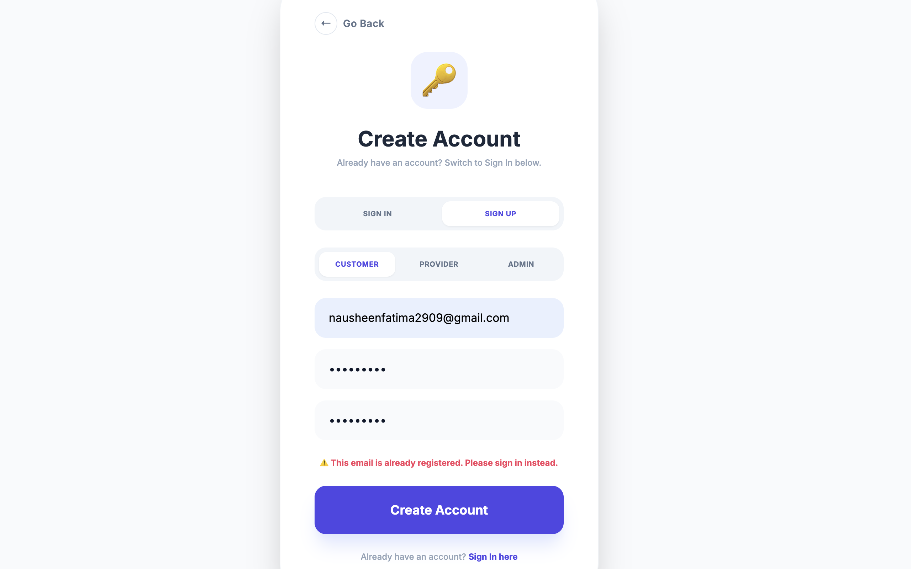
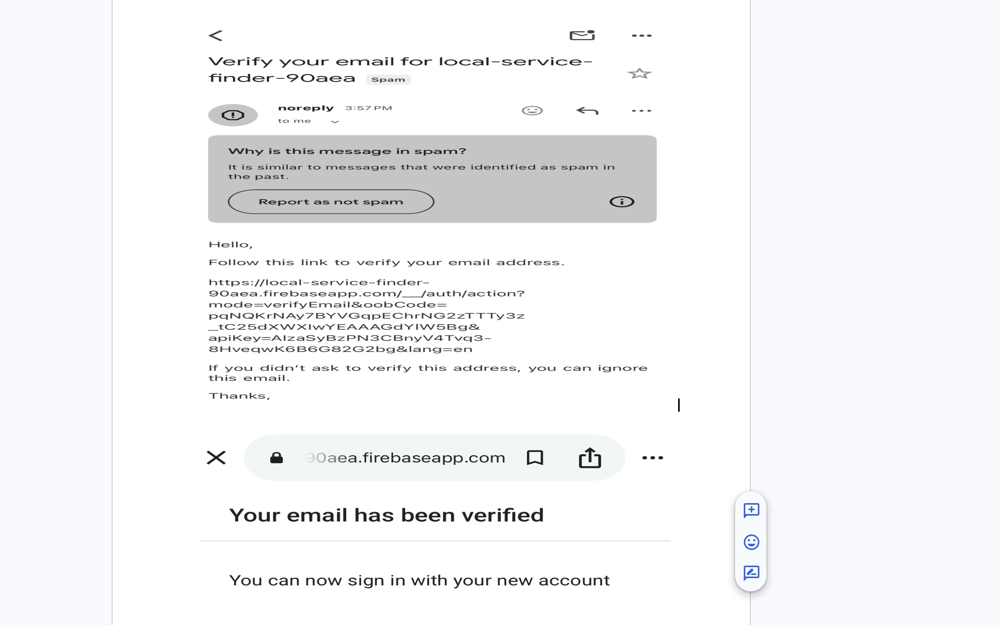
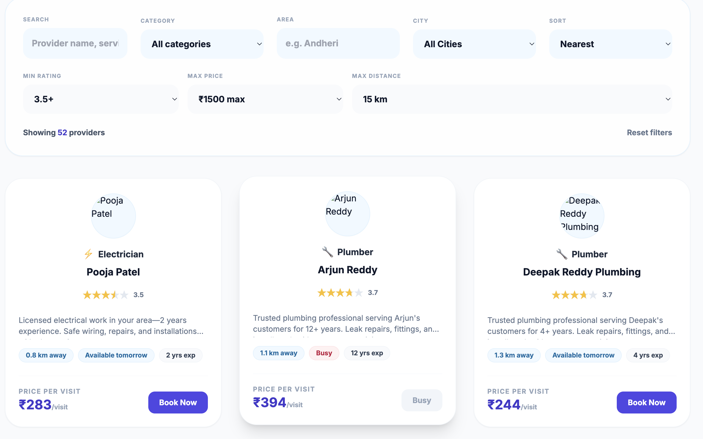
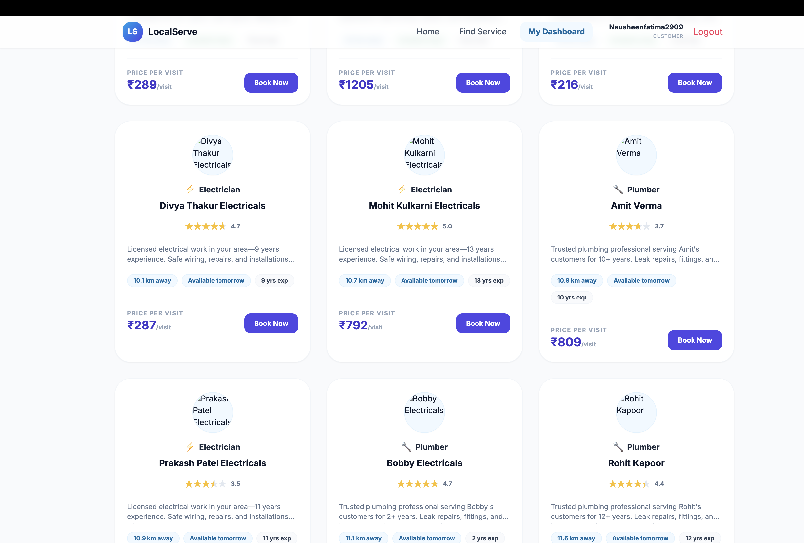
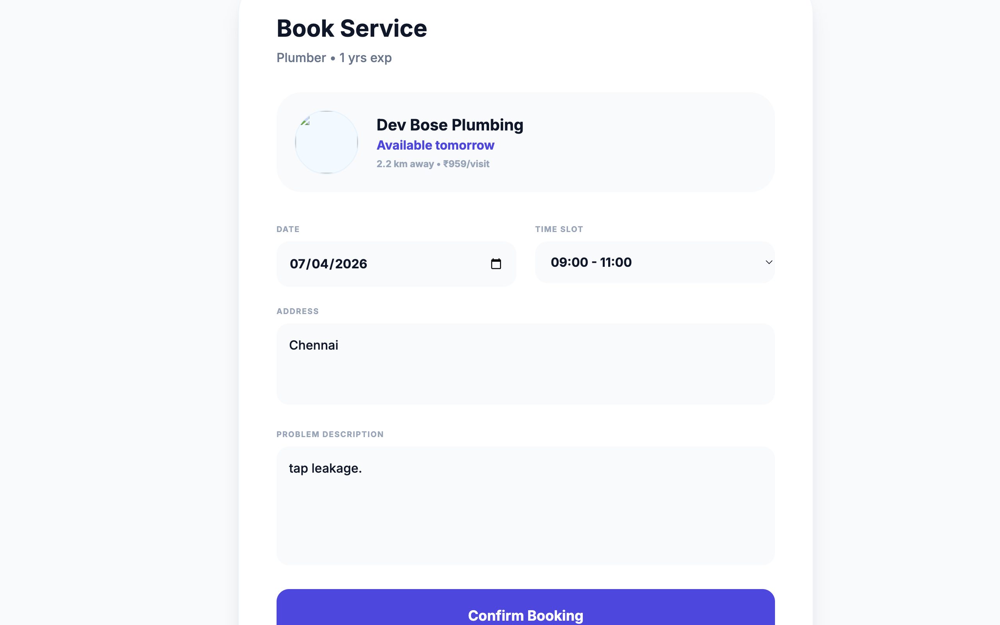
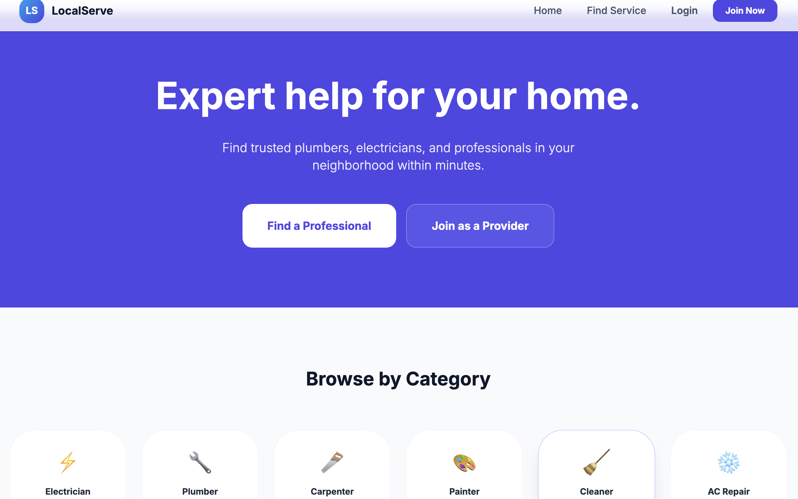
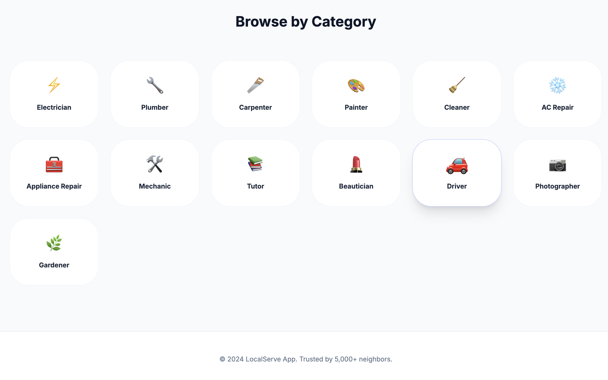
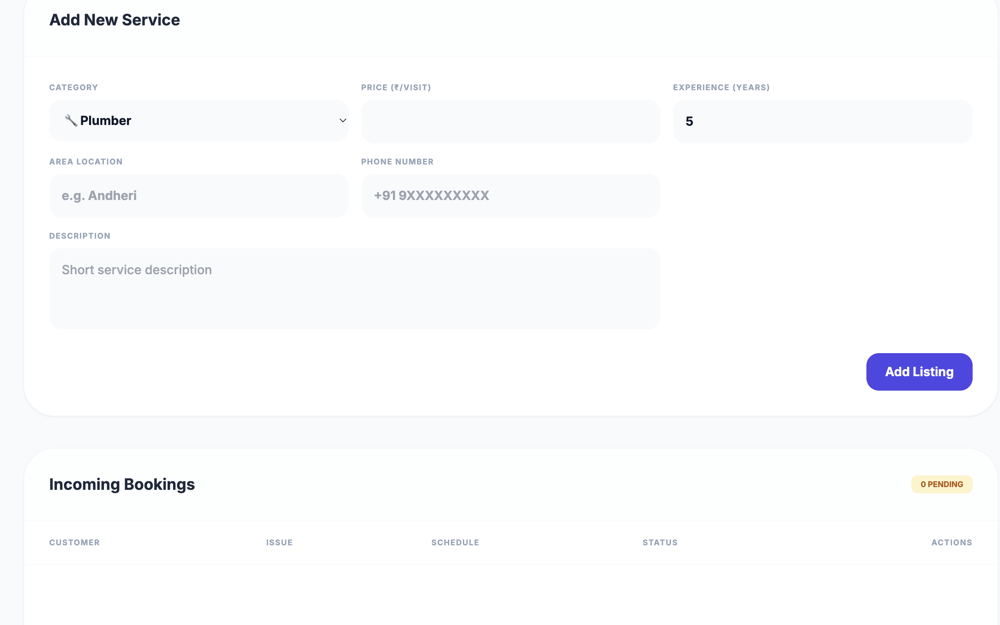
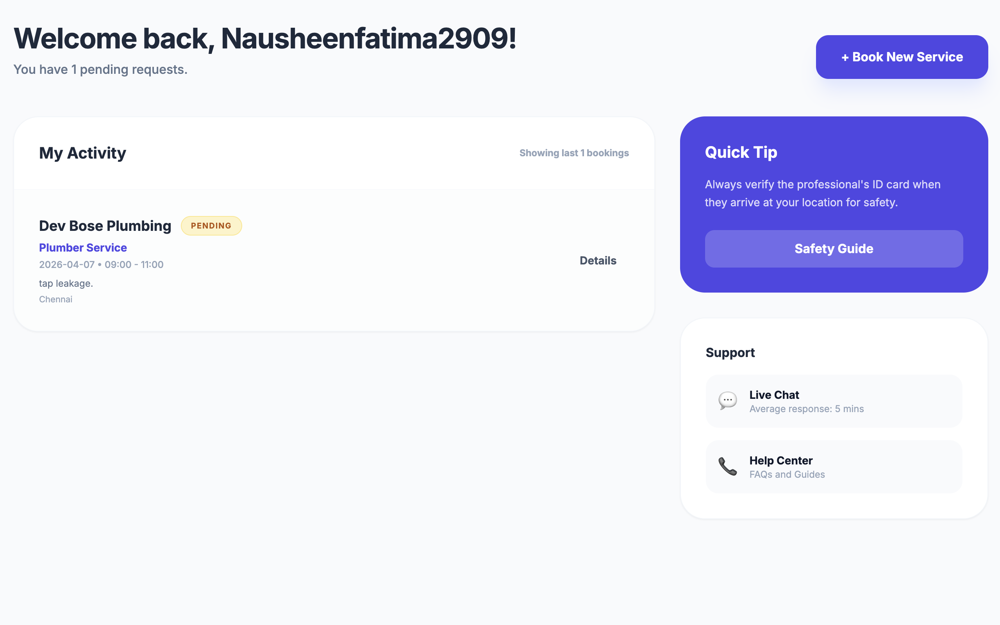
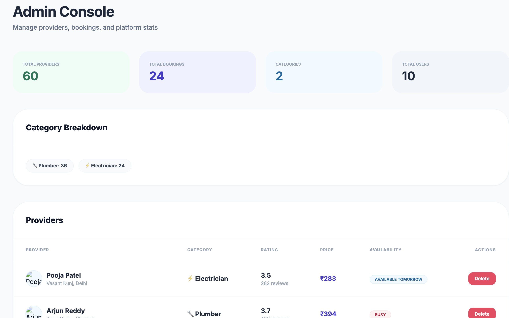

# 🔧 Local Service Finder

A full-stack React web application that connects users with trusted local service providers — plumbers, electricians, and more — in their city. Built using Firebase Authentication, TypeScript, and Tailwind CSS.

🚧 Live Demo: coming soon  
💻 GitHub: https://github.com/YOUR_USERNAME/local-service-finder

---

## 📸 Screenshots

### Login Page


### Email Verification


### Find Services Page


### Services List (More Providers)


### Booking Interface


### Customer Dashboard


### Dashboard View 2


### Provider Dashboard


### Booking Status Tracking


### Admin Panel


---

## 📋 Overview

Local Service Finder is a role-based service marketplace where:

- Customers browse and book service providers by category, area, and city
- Providers manage their listings and respond to booking requests
- Admins oversee all providers and platform activity

Authentication is handled through Firebase — users sign up with a real email, receive a verification link, and only gain access after verifying.

---

## ✨ Features

### 🔐 Authentication

- Firebase Email/Password sign-up and sign-in
- Email verification required before login
- Resend verification email option
- Role selection at login:
  - Customer
  - Provider
  - Admin
- Unverified sessions automatically signed out

---

### 🔍 Search & Filtering

- Filter providers by category (Plumber, Electrician)
- Filter by area (text search)
- Filter by city (dropdown)
- Filter by rating, price, and distance
- Sort by:
  - nearest
  - highest rated
  - lowest price

Results update instantly when filters change.

---

### 🃏 Provider Cards

Each provider card displays:

- Profile image
- Category icon
- Name and rating
- Experience years
- Distance from user
- Availability status
- Price per visit
- Book Now button

---

### 📊 Role Dashboards

Customer Dashboard:
- view bookings
- track status

Provider Dashboard:
- manage services
- update price & availability
- accept or reject bookings

Admin Dashboard:
- view all providers
- monitor bookings
- manage listings

---

### 📅 Booking Flow

- Select date and time slot
- Enter address
- Describe issue
- Track booking status:
  Pending → Accepted → Completed

---

## 🛠 Tech Stack

| Layer | Technology |
|------|------------|
| Frontend | React 19 + TypeScript |
| Build Tool | Vite 6 |
| Styling | Tailwind CSS |
| Authentication | Firebase Auth |
| Routing | React Router DOM |
| Data | JSON dataset |
| Icons | Emoji |
| Font | Inter |

---

## 🚀 Installation & Setup

### Prerequisites

- Node.js v18+
- npm v9+
- Firebase project with Email/Password enabled

---

### 1. Clone repository

```bash
git clone https://github.com/nausheenfatima2909/local-service-finder.git
cd local-service-finder